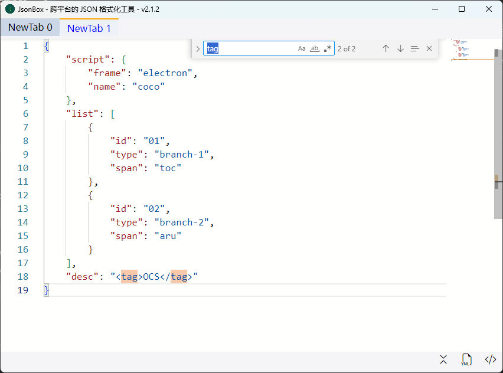

# 一点说明

master分支的版本是自己实现的 JSON 格式化、代码着色，使用的编辑器是 `

` ，但是当内容比较大的时候在搜索上面表现会开始变慢，比如内容达到70k+的时候，搜索会有秒级的卡顿。

这个分支选择使用 `monaco editor` ，在大文本上的表现都非常好，毕竟是vscode的编辑器，就是牛逼～

# 组件/框架

[Monaco Editor (microsoft.github.io)](https://microsoft.github.io/monaco-editor/)

[vite](https://cn.vitejs.dev/)

[vue3](https://cn.vuejs.org/)

[Vue Router | Vue.js 的官方路由 (vuejs.org)](https://router.vuejs.org/zh/)

[Bootstrap Icons](https://icons.getbootstrap.com/)

# 应用截图

